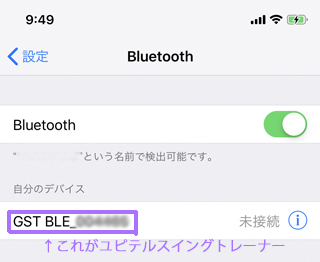
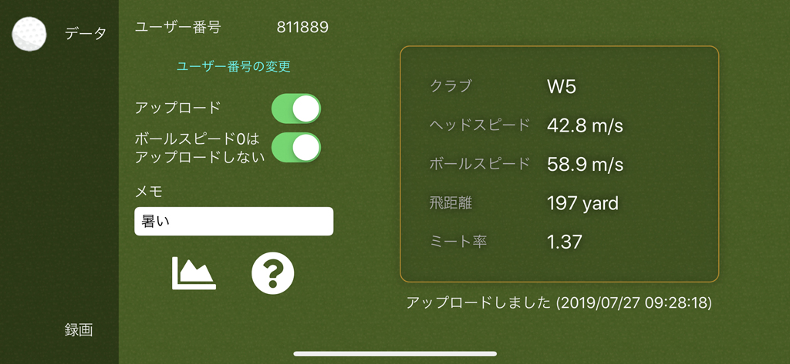
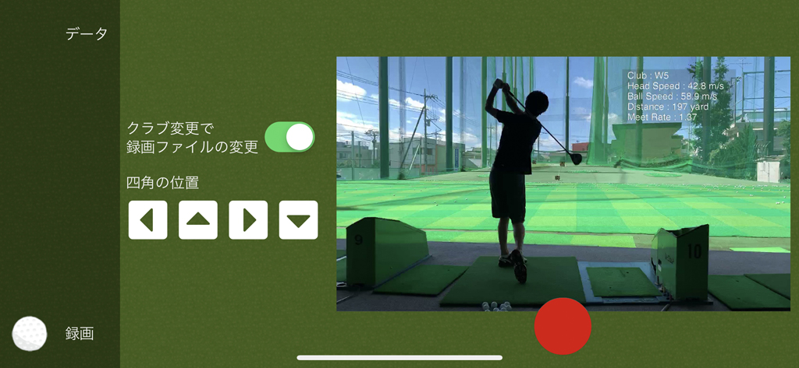

# SwingLogger
ユピテル ゴルフスイングトレーナー GST-7 BLEを使ってスマホでどうにかするやつ

# 事前準備
## GST-7との接続
スマホとGST-7はペアリングしておいてください。純正アプリでデータが見えていることが前提です。
本アプリと純正アプリの同時使用は不可能なので必ず純正アプリは終了しておいてください

OSのBluetoothの設定ではこのような感じになっているはずです

スクショはiPhoneのものですがAndroidも多分似たような感じになっていると思います

## データをクラウドにアップロードする準備

データをクラウドに上げる場合、事前にユーザー登録が必要です

[http://swingdataviewer.azurewebsites.net/Register](http://swingdataviewer.azurewebsites.net/Register)

上記リンクから登録を行っておいてください

# 起動
アプリを起動すると諸々の許可を求めてくると思うので全部許可してください

全部許可したら一度アプリケーションを終了してもう一度起動してください

# 初期画面

## Data Upload
チェックするとクラウドにアップロードします

初回はログイン画面に遷移するので準備しておいたIDとPasswordを入れてください

## Device ID / Change Id
現在のIDです

変更したい時はChange Idをタップしてください

## Scanning GST...

付近のBluetoothデバイスを探して一覧に表示します

GST-7 Bleは「GST BLE…」という名前のはずなので対象の機器だと思われるものの「Use This Device」ボタンを押してください

選択した機器が自分のGST-7である場合、同装置のランプが点灯→点滅するはずです

# Loggin画面

デバイスの選択が終わると下記画面に遷移します

まずはGST-7でクラブの変更を行ってみてください、画面右上の「Club:W1」の部分が選択したクラブに変わるはずです

変わらない場合GST-7につながっていないのでアプリを終了して初めからやり直してください

## Preview
画面背景であるカメラ画像を消します。録画時のバッテリー消費を抑える目的で作ってあります（効果はしらない）

## Swap
録画時にクラブ選択を行うと自動的に動画ファイルを切り替えます。切り替えの判断はクラブ選択後3秒間選択が無かった時です

## Record
録画を開始します

## Stop
録画を停止します

## ←↑→↓
デフォルトで右上に重畳してあるやつを移動します

## Debug
嘘データを画面に表示します

# 使い方
録画が主目的ではなくデータをクラウドに上げるのが目的のアプリです

その場合

- 初期画面で「Data Upload」をチェックしてデバイス選択
- Logging画面でデータを受信できていることを確認
- Sleep画面(電源ボタンぽちっ)

でデータをクラウドに上げ続けるはずです(要チェック)

この方法であれば電池の消費も抑えられるはずはず

## 録画について

録画処理は超てきとうです。多分録画できる、レベルです。ご注意を

- 録画中にSleep状態になったりバックグラウンドに行った場合どのような動作をするのか確認していません
- 録画が正しくできている保証はありません
- 調子が悪くなったらアプリケーションの再起動をしてください

# 注意事項

## Scanning GST... で一覧にGST-7デバイスが出てこない
まれによくあります。GST-7 Bleの電源を入れなおすと大体でてきます

それでもだめならペアリングからやり直してください
