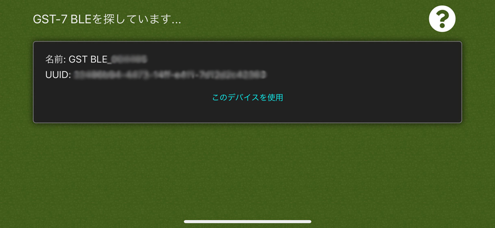
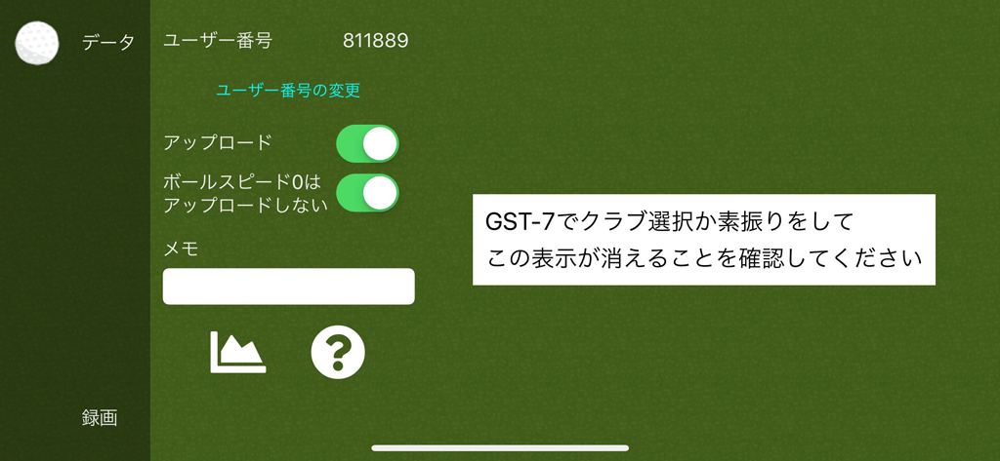
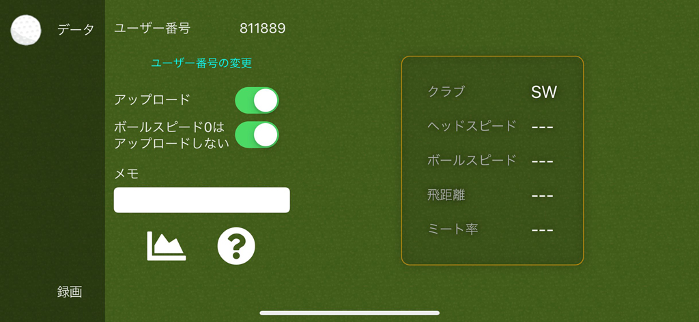

# SwingLogger
ユピテル ゴルフスイングトレーナー GST-7 BLEを使ってスマホでどうにかするやつ

# 事前準備
## GST-7との接続
スマホとGST-7はペアリングしておいてください。純正アプリでデータが見えていることが前提です。
本アプリと純正アプリの同時使用は不可能なので必ず純正アプリは終了しておいてください

OSのBluetoothの設定ではこのような感じになっているはずです

スクショはiPhoneのものですがAndroidも多分似たような感じになっていると思います

## データをクラウドにアップロードする準備

データをクラウドに上げる場合、事前にユーザー登録が必要です

[http://swingdataviewer.azurewebsites.net/Register](http://swingdataviewer.azurewebsites.net/Register)

上記リンクから登録を行っておいてください

# 起動
アプリを起動すると諸々の許可を求めてくると思うので全部許可してください

全部許可したら一度アプリケーションを終了してもう一度起動してください

# 初期画面

## GST-7 BLEを探しています...

付近のBluetoothデバイスを探して一覧に表示します

GST-7 BLEは「GST BLE…」という名前のはずなので対象の機器だと思われるものの「このデバイスを使用」ボタンを押してください

選択した機器が自分のGST-7である場合、同装置のランプが点灯→点滅するはずです

# Loggin画面

デバイスの選択が終わると下記画面に遷移します

まずはGST-7でクラブの変更を行ってみてください、画面右の部分が選択したクラブに変わるはずです

変わらない場合GST-7につながっていないのでアプリを終了して初めからやり直してください

## データ

GST-7 BLEから受信したデータを表示しています

### ユーザー番号

クラウドにデータをアップロードする時はユーザーを識別するための番号が必要になります。ここには登録している番号が表示されます

### ユーザー番号の変更

上記ユーザー番号を変更します

### アップロード

データをクラウドにアップロードします。チェックが外れている時はアップロードしません

- ボールスピード0はアップロードしない

GST-7 BLEでボールスピードが0と出たデータに関してはクラウドにアップロードしません。このチェックを外すと素振り等のデータがすべてアップロードされます

### メモ

メモを残せます。一緒にクラウドに飛んでいきます

## 録画

### クラブ変更で録画ファイルの変更

録画中にクラブ選択を行うと自動的に動画ファイルを切り替えます。切り替えの判断はクラブ選択後3秒間選択が無かった時です

### 四角の位置

右上に重畳しているやつを移動します

# 使い方
録画が主目的ではなくデータをクラウドに上げるのが目的のアプリです

その場合

- 初期画面でデバイス選択
- データ画面でデータを受信できていることを確認
- Sleep画面(電源ボタンぽちっ)

でデータをクラウドに上げ続けるはずです(要チェック)

この方法であれば電池の消費も抑えられるはずはず

## 録画について

録画処理は超てきとうです。多分録画できる、レベルです。ご注意を

- 録画中にSleep状態になったりバックグラウンドに行った場合どのような動作をするのか確認していません
- 録画が正しくできている保証はありません
- 調子が悪くなったらアプリケーションの再起動をしてください

# 注意事項

## GST-7 BLEを探しています... で一覧にGST-7デバイスが出てこない
まれによくあります。GST-7 BLEの電源を入れなおすと大体でてきます

それでもだめならペアリングからやり直してください
